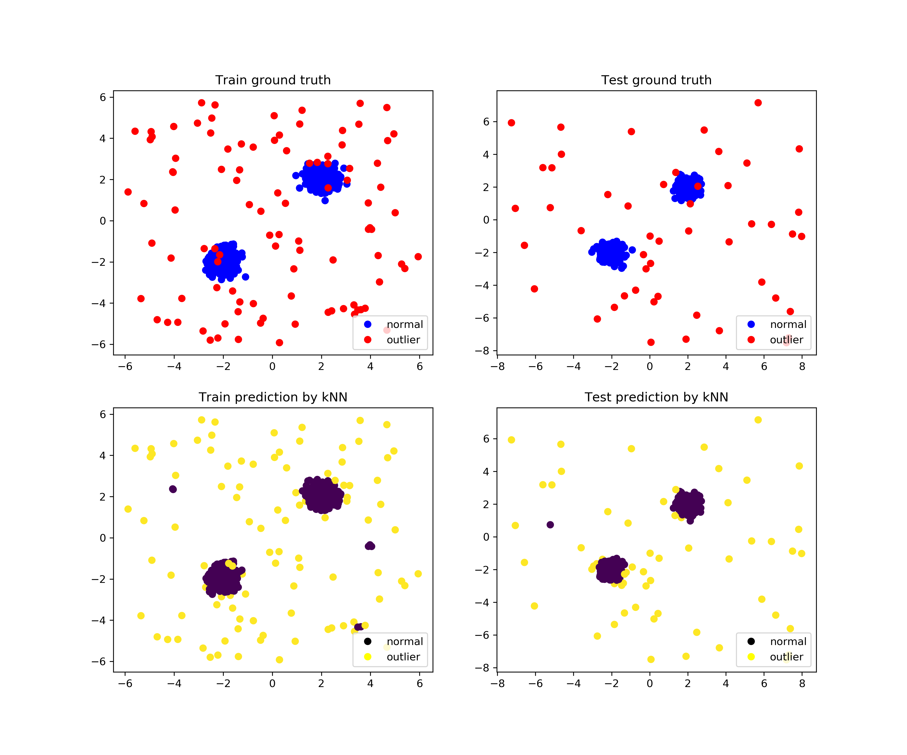

Examples
============

Example APIs
---------------
.. toctree::

    examples

kNN Example
----------------

Full example: `knn_example.py <https://github.com/yzhao062/Pyod/blob/master/examples/knn_example.py>`_

1. Import models::

    from pyod.models.knn import KNN  # kNN detector

    from pyod.utils.load_data import generate_data
    from pyod.utils.utility import precision_n_scores
    from sklearn.metrics import roc_auc_score

2. Generate sample data with :func:`pyod.utils.load_data.generate_data`: ::

    contamination = 0.1  # percentage of outliers
    n_train = 1000  # number of training points
    n_test = 500  # number of testing points

    X_train, y_train, c_train, X_test, y_test, c_test = generate_data(
        n_train=n_train, n_test=n_test, contamination=contamination)

3. Initialize a :class:`pyod.models.knn.KNN` detector, fit the model, and make the prediction: ::

    # train a k-NN detector (default parameters, k=10)
    clf = KNN()
    clf.fit(X_train)

    # get the prediction label and scores on the training data
    y_train_pred = clf.y_pred
    y_train_score = clf.decision_scores

    # get the prediction on the test data
    y_test_pred = clf.predict(X_test)  # outlier label (0 or 1)
    y_test_score = clf.decision_function(X_test)  # outlier scores

4. Evaluate the prediction by ROC and Precision@rank n (p@n): ::

    print(n_train.format(
        roc=roc_auc_score(y_train, y_train_score),
        prn=precision_n_scores(y_train, y_train_score)))

    print(n_train.format(
        roc=roc_auc_score(y_test, y_test_score),
        prn=precision_n_scores(y_test, y_test_score)))

Sample outpus: ::

    Train ROC:0.9473, precision@n:0.7857
    Test ROC:0.992, precision@n:0.9

   kNN detector demo.

Model Combination Example
--------------------------
`comb_example.py <https://github.com/yzhao062/Pyod/blob/master/examples/comb_example.py>`_ is a quick demo for showing the API for combining multiple algorithms.
Given we have *n* individual outlier detectors, each of them generates an individual score for all samples. The task is to combine the outputs from these detectors effectivelly.

1. Import models and generate sample data: ::

    from pyod.models.knn import KNN
    from pyod.models.combination import aom, moa # combination methods
    from pyod.utils.load_data import generate_data
    from pyod.utils.utility import precision_n_scores
    from pyod.utils.utility import standardizer
    from sklearn.metrics import roc_auc_score

    X, y, _ = generate_data(train_only=True)  # load data

2. First initialize 20 kNN outlier detectors with different k (10 to 200), and get the outlier scores: ::

    # initialize 20 base detectors for combination
    k_list = [10, 20, 30, 40, 50, 60, 70, 80, 90, 100, 110, 120, 130, 140,
                150, 160, 170, 180, 190, 200]

    train_scores = np.zeros([X_train.shape[0], n_clf])
    test_scores = np.zeros([X_test.shape[0], n_clf])

    for i in range(n_clf):
        k = k_list[i]

        clf = KNN(n_neighbors=k, method='largest')
        clf.fit(X_train_norm)

        train_scores[:, i] = clf.decision_scores.ravel()
        test_scores[:, i] = clf.decision_function(X_test_norm).ravel()

3. Then the output codes are standardized into zero mean and unit std before combination: ::

    # scores have to be normalized before combination
    train_scores_norm, test_scores_norm = standardizer(train_scores, test_scores)
    Then four different combination algorithms are applied as described above:

    comb_by_mean = np.mean(test_scores_norm, axis=1)
    comb_by_max = np.max(test_scores_norm, axis=1)
    comb_by_aom = aom(test_scores_norm, 5) # 5 groups
    comb_by_moa = moa(test_scores_norm, 5)) # 5 groups

4. Finally, all four combination methods are evaluated with 20 iterations: ::

    Combining 20 kNN detectors
    ite 1 comb by mean, ROC: 0.9014 precision@n_train: 0.4531
    ite 1 comb by max, ROC: 0.9014 precision@n_train: 0.5
    ite 1 comb by aom, ROC: 0.9081 precision@n_train: 0.5
    ite 1 comb by moa, ROC: 0.9052 precision@n_train: 0.4843
    ...

    Summary of 10 iterations
    comb by mean, ROC: 0.9196, precision@n: 0.5464
    comb by max, ROC: 0.9198, precision@n: 0.5532
    comb by aom, ROC: 0.9260, precision@n: 0.5630
    comb by moa, ROC: 0.9244, precision@n: 0.5523
