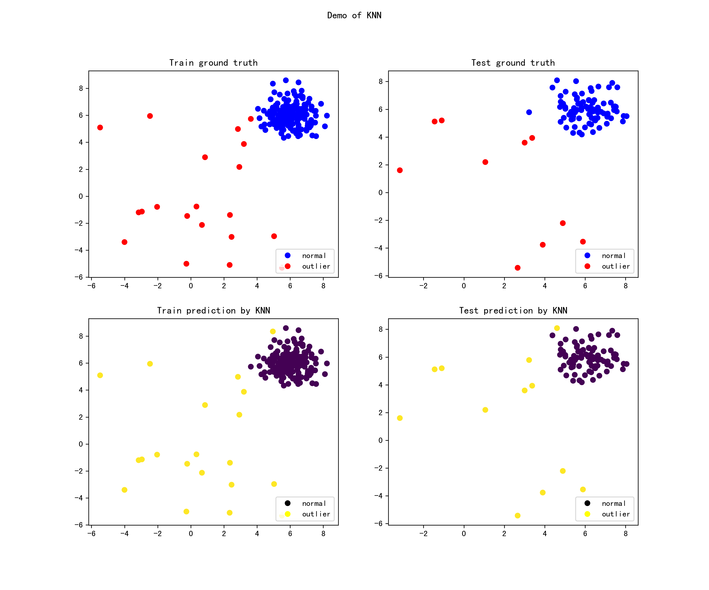

Examples
========

----

Featured Tutorials
------------------

PyOD has been well acknowledged by the machine learning community with a few featured posts and tutorials.

**Analytics Vidhya**: `An Awesome Tutorial to Learn Outlier Detection in Python using PyOD Library <https://www.analyticsvidhya.com/blog/2019/02/outlier-detection-python-pyod/>`_

**KDnuggets**: `Intuitive Visualization of Outlier Detection Methods <https://www.kdnuggets.com/2019/02/outlier-detection-methods-cheat-sheet.html>`_

**Towards Data Science**: `Anomaly Detection for Dummies <https://towardsdatascience.com/anomaly-detection-for-dummies-15f148e559c1>`_

**Computer Vision News (March 2019)**: `Python Open Source Toolbox for Outlier Detection <https://rsipvision.com/ComputerVisionNews-2019March/18/>`_

**awesome-machine-learning**: `General-Purpose Machine Learning <https://github.com/josephmisiti/awesome-machine-learning#python-general-purpose>`_

----

kNN Example
-----------

Full example: `knn_example.py <https://github.com/yzhao062/Pyod/blob/master/examples/knn_example.py>`_

1. Import models

    .. code-block:: python

        from pyod.models.knn import KNN   # kNN detector

2. Generate sample data with :func:`pyod.utils.data.generate_data`:

    .. code-block:: python

        contamination = 0.1  # percentage of outliers
        n_train = 200  # number of training points
        n_test = 100  # number of testing points

        X_train, y_train, X_test, y_test = generate_data(
            n_train=n_train, n_test=n_test, contamination=contamination)

3. Initialize a :class:`pyod.models.knn.KNN` detector, fit the model, and make
   the prediction.

    .. code-block:: python

        # train kNN detector
        clf_name = 'KNN'
        clf = KNN()
        clf.fit(X_train)

        # get the prediction labels and outlier scores of the training data
        y_train_pred = clf.labels_  # binary labels (0: inliers, 1: outliers)
        y_train_scores = clf.decision_scores_  # raw outlier scores

        # get the prediction on the test data
        y_test_pred = clf.predict(X_test)  # outlier labels (0 or 1)
        y_test_scores = clf.decision_function(X_test)  # outlier scores

4. Evaluate the prediction using ROC and Precision @ Rank n :func:`pyod.utils.data.evaluate_print`.

    .. code-block:: python

        from pyod.utils.data import evaluate_print
        # evaluate and print the results
        print("\nOn Training Data:")
        evaluate_print(clf_name, y_train, y_train_scores)
        print("\nOn Test Data:")
        evaluate_print(clf_name, y_test, y_test_scores)

5. See sample outputs on both training and test data.

    .. code-block:: bash

        On Training Data:
        KNN ROC:1.0, precision @ rank n:1.0

        On Test Data:
        KNN ROC:0.9989, precision @ rank n:0.9

6. Generate the visualizations by visualize function included in all examples.

    .. code-block:: python

        visualize(clf_name, X_train, y_train, X_test, y_test, y_train_pred,
                  y_test_pred, show_figure=True, save_figure=False)

----

Model Combination Example
-------------------------

Outlier detection often suffers from model instability due to its unsupervised
nature. Thus, it is recommended to combine various detector outputs, e.g., by averaging,
to improve its robustness. Detector combination is a subfield of outlier ensembles;
refer :cite:`b-kalayci2018anomaly` for more information.

Four score combination mechanisms are shown in this demo:

#. **Average**: average scores of all detectors.
#. **maximization**: maximum score across all detectors.
#. **Average of Maximum (AOM)**: divide base detectors into subgroups and take the maximum score for each subgroup. The final score is the average of all subgroup scores.
#. **Maximum of Average (MOA)**: divide base detectors into subgroups and take the average score for each subgroup. The final score is the maximum of all subgroup scores.

"examples/comb_example.py" illustrates the API for combining the output of multiple base detectors
(\ `comb_example.py <https://github.com/yzhao062/pyod/blob/master/examples/comb_example.py>`_\ ,
`Jupyter Notebooks <https://mybinder.org/v2/gh/yzhao062/pyod/master>`_\ ). For Jupyter Notebooks,
please navigate to **"/notebooks/Model Combination.ipynb"**

1. Import models and generate sample data.

    .. code-block:: python

        from pyod.models.knn import KNN  # kNN detector
        from pyod.models.combination import aom, moa, average, maximization
        from pyod.utils.data import generate_data

        X, y= generate_data(train_only=True)  # load data

2. Initialize 20 kNN outlier detectors with different k (10 to 200), and get the outlier scores.

    .. code-block:: python

        # initialize 20 base detectors for combination
        k_list = [10, 20, 30, 40, 50, 60, 70, 80, 90, 100, 110, 120, 130, 140,
                    150, 160, 170, 180, 190, 200]

        train_scores = np.zeros([X_train.shape[0], n_clf])
        test_scores = np.zeros([X_test.shape[0], n_clf])

        for i in range(n_clf):
            k = k_list[i]

            clf = KNN(n_neighbors=k, method='largest')
            clf.fit(X_train_norm)

            train_scores[:, i] = clf.decision_scores_
            test_scores[:, i] = clf.decision_function(X_test_norm)

3. Then the output scores are standardized into zero average and unit std before combination.
   This step is crucial to adjust the detector outputs to the same scale.

    .. code-block:: python

        from pyod.utils.utility import standardizer

        # scores have to be normalized before combination
        train_scores_norm, test_scores_norm = standardizer(train_scores, test_scores)

4. Four different combination algorithms are applied as described above:

    .. code-block:: python

        comb_by_average = average(test_scores_norm)
        comb_by_maximization = maximization(test_scores_norm)
        comb_by_aom = aom(test_scores_norm, 5) # 5 groups
        comb_by_moa = moa(test_scores_norm, 5)) # 5 groups

5. Finally, all four combination methods are evaluated by ROC and Precision
   @ Rank n:

    .. code-block:: bash

        Combining 20 kNN detectors
        Combination by Average ROC:0.9194, precision @ rank n:0.4531
        Combination by Maximization ROC:0.9198, precision @ rank n:0.4688
        Combination by AOM ROC:0.9257, precision @ rank n:0.4844
        Combination by MOA ROC:0.9263, precision @ rank n:0.4688

.. rubric:: References

.. bibliography::
   :cited:
   :labelprefix: B
   :keyprefix: b-