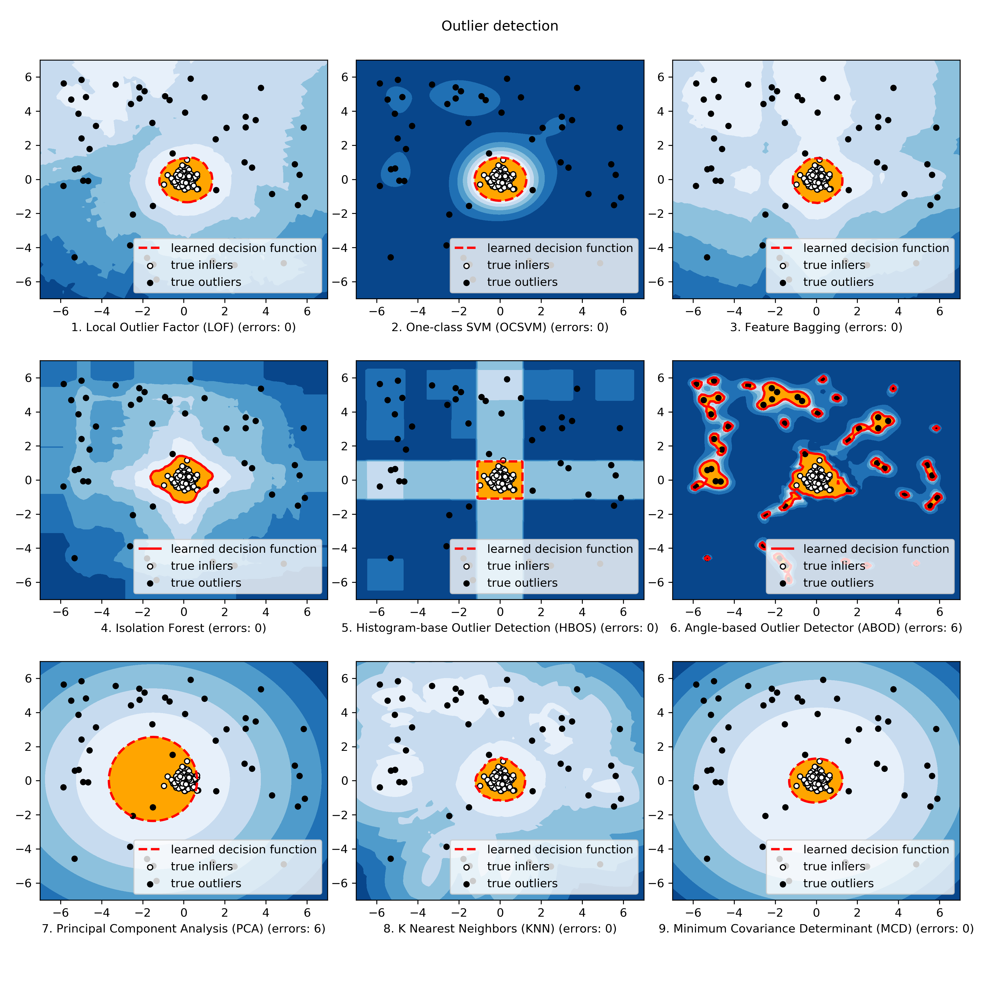

.. pyod documentation master file, created by
   sphinx-quickstart on Sun May 27 10:56:38 2018.
   You can adapt this file completely to your liking, but it should at least
   contain the root `toctree` directive.

Welcome to PyOD documentation!
==============================

**Deployment & Documentation & Stats**

.. image:: https://img.shields.io/pypi/v/pyod.svg?color=brightgreen
   :target: https://pypi.org/project/pyod/
   :alt: PyPI version

.. image:: https://anaconda.org/conda-forge/pyod/badges/version.svg
   :target: https://anaconda.org/conda-forge/pyod
   :alt: Anaconda version

.. image:: https://readthedocs.org/projects/pyod/badge/?version=latest
   :target: https://pyod.readthedocs.io/en/latest/?badge=latest
   :alt: Documentation status

.. image:: https://mybinder.org/badge_logo.svg
   :target: https://mybinder.org/v2/gh/yzhao062/pyod/master
   :alt: Binder

.. image:: https://img.shields.io/github/stars/yzhao062/pyod.svg
   :target: https://github.com/yzhao062/pyod/stargazers
   :alt: GitHub stars

.. image:: https://img.shields.io/github/forks/yzhao062/pyod.svg?color=blue
   :target: https://github.com/yzhao062/pyod/network
   :alt: GitHub forks

.. image:: https://pepy.tech/badge/pyod
   :target: https://pepy.tech/project/pyod
   :alt: Downloads

.. image:: https://pepy.tech/badge/pyod/month
   :target: https://pepy.tech/project/pyod
   :alt: Downloads

-----

**Build Status & Coverage & Maintainability & License**

.. image:: https://ci.appveyor.com/api/projects/status/1kupdy87etks5n3r/branch/master?svg=true
   :target: https://ci.appveyor.com/project/yzhao062/pyod/branch/master
   :alt: Build status

.. image:: https://travis-ci.org/yzhao062/pyod.svg?branch=master
   :target: https://travis-ci.org/yzhao062/pyod
   :alt: Build Status

.. image:: https://circleci.com/gh/yzhao062/pyod.svg?style=svg
   :target: https://circleci.com/gh/yzhao062/pyod
   :alt: Circle CI

.. image:: https://coveralls.io/repos/github/yzhao062/pyod/badge.svg
   :target: https://coveralls.io/github/yzhao062/pyod
   :alt: Coverage Status

.. image:: https://api.codeclimate.com/v1/badges/bdc3d8d0454274c753c4/maintainability
   :target: https://codeclimate.com/github/yzhao062/Pyod/maintainability
   :alt: Maintainability

.. image:: https://img.shields.io/github/license/yzhao062/pyod.svg
   :target: https://github.com/yzhao062/pyod/blob/master/LICENSE
   :alt: License

----

PyOD is a comprehensive and scalable **Python toolkit** for **detecting outlying objects** in
multivariate data. This exciting yet challenging field is commonly referred as
`Outlier Detection <https://en.wikipedia.org/wiki/Anomaly_detection>`_
or `Anomaly Detection <https://en.wikipedia.org/wiki/Anomaly_detection>`_.

PyOD includes more than 30 detection algorithms, from classical LOF (SIGMOD 2000) to
the latest COPOD (ICDM 2020). Since 2017, PyOD :cite:`a-zhao2019pyod` has been successfully used in numerous
academic researches and commercial products :cite:`a-gopalan2019pidforest,a-li2019mad,a-wang2019advae,a-zhao2019lscp`.
It is also well acknowledged by the machine learning community with various dedicated posts/tutorials, including
`Analytics Vidhya <https://www.analyticsvidhya.com/blog/2019/02/outlier-detection-python-pyod/>`_,
`Towards Data Science <https://towardsdatascience.com/anomaly-detection-for-dummies-15f148e559c1>`_,
`KDnuggets <https://www.kdnuggets.com/2019/02/outlier-detection-methods-cheat-sheet.html>`_,
`Computer Vision News <https://rsipvision.com/ComputerVisionNews-2019March/18/>`_, and
`awesome-machine-learning <https://github.com/josephmisiti/awesome-machine-learning#python-general-purpose>`_.

PyOD is featured for:

* **Unified APIs, detailed documentation, and interactive examples** across various algorithms.
* **Advanced models**\ , including **classical ones from scikit-learn**, **latest deep learning methods**, and **emerging algorithms like COPOD**.
* **Optimized performance with JIT and parallelization** when possible, using `numba <https://github.com/numba/numba>`_ and `joblib <https://github.com/joblib/joblib>`_.
* **Compatible with both Python 2 & 3**.

**API Demo**\ :

.. code-block:: python

    # train the COPOD detector
    from pyod.models.copod import COPOD
    clf = COPOD()
    clf.fit(X_train)

    # get outlier scores
    y_train_scores = clf.decision_scores_  # raw outlier scores
    y_test_scores = clf.decision_function(X_test)  # outlier scores

**Citing PyOD**\ :

`PyOD paper <http://www.jmlr.org/papers/volume20/19-011/19-011.pdf>`_ is published in
`JMLR <http://www.jmlr.org/>`_ (machine learning open-source software track).
If you use PyOD in a scientific publication, we would appreciate
citations to the following paper::

    @article{zhao2019pyod,
      author  = {Zhao, Yue and Nasrullah, Zain and Li, Zheng},
      title   = {PyOD: A Python Toolbox for Scalable Outlier Detection},
      journal = {Journal of Machine Learning Research},
      year    = {2019},
      volume  = {20},
      number  = {96},
      pages   = {1-7},
      url     = {http://jmlr.org/papers/v20/19-011.html}
    }

or::

    Zhao, Y., Nasrullah, Z. and Li, Z., 2019. PyOD: A Python Toolbox for Scalable Outlier Detection. Journal of machine learning research (JMLR), 20(96), pp.1-7.

**Key Links and Resources**\ :

* `View the latest codes on Github <https://github.com/yzhao062/pyod>`_
* `Execute Interactive Jupyter Notebooks <https://mybinder.org/v2/gh/yzhao062/pyod/master>`_
* `Anomaly Detection Resources <https://github.com/yzhao062/anomaly-detection-resources>`_

----

Implemented Algorithms
======================

PyOD toolkit consists of three major functional groups:

**(i) Individual Detection Algorithms** :

1. Linear Models for Outlier Detection:

===================  ================  ======================================================================================================  =====  ===================================================  ======================================================
Type                 Abbr              Algorithm                                                                                               Year   Class                                                Ref
===================  ================  ======================================================================================================  =====  ===================================================  ======================================================
Linear Model         PCA               Principal Component Analysis (the sum of weighted projected distances to the eigenvector hyperplanes)   2003   :class:`pyod.models.pca.PCA`                         :cite:`a-shyu2003novel`
Linear Model         MCD               Minimum Covariance Determinant (use the mahalanobis distances as the outlier scores)                    1999   :class:`pyod.models.mcd.MCD`                         :cite:`a-rousseeuw1999fast,a-hardin2004outlier`
Linear Model         OCSVM             One-Class Support Vector Machines                                                                       2001   :class:`pyod.models.ocsvm.OCSVM`                     :cite:`a-scholkopf2001estimating`
Linear Model         LMDD              Deviation-based Outlier Detection (LMDD)                                                                1996   :class:`pyod.models.lmdd.LMDD`                       :cite:`a-arning1996linear`
Proximity-Based      LOF               Local Outlier Factor                                                                                    2000   :class:`pyod.models.lof.LOF`                         :cite:`a-breunig2000lof`
Proximity-Based      COF               Connectivity-Based Outlier Factor                                                                       2002   :class:`pyod.models.cof.COF`                         :cite:`a-tang2002enhancing`
Proximity-Based      CBLOF             Clustering-Based Local Outlier Factor                                                                   2003   :class:`pyod.models.cblof.CBLOF`                     :cite:`a-he2003discovering`
Proximity-Based      LOCI              LOCI: Fast outlier detection using the local correlation integral                                       2003   :class:`pyod.models.loci.LOCI`                       :cite:`a-papadimitriou2003loci`
Proximity-Based      HBOS              Histogram-based Outlier Score                                                                           2012   :class:`pyod.models.hbos.HBOS`                       :cite:`a-goldstein2012histogram`
Proximity-Based      kNN               k Nearest Neighbors (use the distance to the kth nearest neighbor as the outlier score                  2000   :class:`pyod.models.knn.KNN`                         :cite:`a-ramaswamy2000efficient,a-angiulli2002fast`
Proximity-Based      AvgKNN            Average kNN (use the average distance to k nearest neighbors as the outlier score)                      2002   :class:`pyod.models.knn.KNN`                         :cite:`a-ramaswamy2000efficient,a-angiulli2002fast`
Proximity-Based      MedKNN            Median kNN (use the median distance to k nearest neighbors as the outlier score)                        2002   :class:`pyod.models.knn.KNN`                         :cite:`a-ramaswamy2000efficient,a-angiulli2002fast`
Proximity-Based      SOD               Subspace Outlier Detection                                                                              2009   :class:`pyod.models.sod.SOD`                         :cite:`a-kriegel2009outlier`
Proximity-Based      ROD               Rotation-based Outlier Detection                                                                        2020   :class:`pyod.models.rod.ROD`                         :cite:`a-almardeny2020novel`
Probabilistic        ABOD              Angle-Based Outlier Detection                                                                           2008   :class:`pyod.models.abod.ABOD`                       :cite:`a-kriegel2008angle`
Probabilistic        FastABOD          Fast Angle-Based Outlier Detection using approximation                                                  2008   :class:`pyod.models.abod.ABOD`                       :cite:`a-kriegel2008angle`
Probabilistic        COPOD             COPOD: Copula-Based Outlier Detection                                                                   2020   :class:`pyod.models.copod.COPOD`                     :cite:`a-li2020copod`
Probabilistic        MAD               Median Absolute Deviation (MAD)                                                                         1993   :class:`pyod.models.mad.MAD`                         :cite:`a-iglewicz1993detect`
Probabilistic        SOS               Stochastic Outlier Selection                                                                            2012   :class:`pyod.models.sos.SOS`                         :cite:`a-janssens2012stochastic`
Outlier Ensembles    IForest           Isolation Forest                                                                                        2008   :class:`pyod.models.iforest.IForest`                 :cite:`a-liu2008isolation,a-liu2012isolation`
Outlier Ensembles                      Feature Bagging                                                                                         2005   :class:`pyod.models.feature_bagging.FeatureBagging`  :cite:`a-lazarevic2005feature`
Outlier Ensembles    LSCP              LSCP: Locally Selective Combination of Parallel Outlier Ensembles                                       2019   :class:`pyod.models.lscp.LSCP`                       :cite:`a-zhao2019lscp`
Outlier Ensembles    XGBOD             Extreme Boosting Based Outlier Detection **(Supervised)**                                               2018   :class:`pyod.models.xgbod.XGBOD`                     :cite:`a-zhao2018xgbod`
Outlier Ensembles    LODA              Lightweight On-line Detector of Anomalies                                                               2016   :class:`pyod.models.loda.LODA`                       :cite:`a-pevny2016loda`
Neural Networks      AutoEncoder       Fully connected AutoEncoder (use reconstruction error as the outlier score)                             2015   :class:`pyod.models.auto_encoder.AutoEncoder`        :cite:`a-aggarwal2015outlier`
Neural Networks      VAE               Variational AutoEncoder (use reconstruction error as the outlier score)                                 2013   :class:`pyod.models.vae.VAE`                         :cite:`a-kingma2013auto`
Neural Networks      Beta-VAE          Variational AutoEncoder (all customized loss term by varying gamma and capacity)                        2018   :class:`pyod.models.vae.VAE`                         :cite:`a-burgess2018understanding`
Neural Networks      SO_GAAL           Single-Objective Generative Adversarial Active Learning                                                 2019   :class:`pyod.models.so_gaal.SO_GAAL`                 :cite:`a-liu2019generative`
Neural Networks      MO_GAAL           Multiple-Objective Generative Adversarial Active Learning                                               2019   :class:`pyod.models.mo_gaal.MO_GAAL`                 :cite:`a-liu2019generative`
===================  ================  ======================================================================================================  =====  ===================================================  ======================================================

**(ii) Outlier Ensembles & Outlier Detector Combination Frameworks**:

===================  ================  =====================================================================================================  =====  ===================================================  ======================================================
Type                 Abbr              Algorithm                                                                                              Year   Ref
===================  ================  =====================================================================================================  =====  ===================================================  ======================================================
Outlier Ensembles                      Feature Bagging                                                                                        2005   :class:`pyod.models.feature_bagging.FeatureBagging`  :cite:`a-lazarevic2005feature`
Outlier Ensembles    LSCP              LSCP: Locally Selective Combination of Parallel Outlier Ensembles                                      2019   :class:`pyod.models.lscp.LSCP`                       :cite:`a-zhao2019lscp`
Outlier Ensembles    XGBOD             Extreme Boosting Based Outlier Detection **(Supervised)**                                              2018   :class:`pyod.models.xgbod.XGBOD`                     :cite:`a-zhao2018xgbod`
Outlier Ensembles    LODA              Lightweight On-line Detector of Anomalies                                                              2016   :class:`pyod.models.loda.LODA`                       :cite:`a-pevny2016loda`
Combination          Average           Simple combination by averaging the scores                                                             2015   :func:`pyod.models.combination.average`              :cite:`a-aggarwal2015theoretical`
Combination          Weighted Average  Simple combination by averaging the scores with detector weights                                       2015   :func:`pyod.models.combination.average`              :cite:`a-aggarwal2015theoretical`
Combination          Maximization      Simple combination by taking the maximum scores                                                        2015   :func:`pyod.models.combination.maximization`         :cite:`a-aggarwal2015theoretical`
Combination          AOM               Average of Maximum                                                                                     2015   :func:`pyod.models.combination.aom`                  :cite:`a-aggarwal2015theoretical`
Combination          MOA               Maximum of Average                                                                                     2015   :func:`pyod.models.combination.moa`                  :cite:`a-aggarwal2015theoretical`
Combination          Median            Simple combination by taking the median of the scores                                                  2015   :func:`pyod.models.combination.median`               :cite:`a-aggarwal2015theoretical`
Combination          majority Vote     Simple combination by taking the majority vote of the labels (weights can be used)                     2015   :func:`pyod.models.combination.majority_vote`        :cite:`a-aggarwal2015theoretical`
===================  ================  =====================================================================================================  =====  ===================================================  ======================================================

**(iii) Utility Functions**:

===================  ==============================================  =====================================================================================================================================================
Type                 Name                                            Function
===================  ==============================================  =====================================================================================================================================================
Data                 :func:`pyod.utils.data.generate_data`           Synthesized data generation; normal data is generated by a multivariate Gaussian and outliers are generated by a uniform distribution
Data                 :func:`pyod.utils.data.generate_data_clusters`  Synthesized data generation in clusters; more complex data patterns can be created with multiple clusters
Stat                 :func:`pyod.utils.stat_models.wpearsonr`        Calculate the weighted Pearson correlation of two samples
Utility              :func:`pyod.utils.utility.get_label_n`          Turn raw outlier scores into binary labels by assign 1 to top n outlier scores
Utility              :func:`pyod.utils.utility.precision_n_scores`   calculate precision @ rank n
===================  ==============================================  =====================================================================================================================================================

**The comparison among of implemented models** is made available below
(\ `Figure <https://raw.githubusercontent.com/yzhao062/pyod/master/examples/ALL.png>`_\ ,
`compare_all_models.py <https://github.com/yzhao062/pyod/blob/master/examples/compare_all_models.py>`_\ ,
`Interactive Jupyter Notebooks <https://mybinder.org/v2/gh/yzhao062/pyod/master>`_\ ).
For Jupyter Notebooks, please navigate to **"/notebooks/Compare All Models.ipynb"**.

Check the latest `benchmark <https://pyod.readthedocs.io/en/latest/benchmark.html>`_. You could replicate this process by running
`benchmark.py <https://github.com/yzhao062/pyod/blob/master/notebooks/benchmark.py>`_.

API Cheatsheet & Reference
==========================

The following APIs are applicable for all detector models for easy use.

* :func:`pyod.models.base.BaseDetector.fit`: Fit detector. y is ignored in unsupervised methods.
* :func:`pyod.models.base.BaseDetector.decision_function`: Predict raw anomaly score of X using the fitted detector.
* :func:`pyod.models.base.BaseDetector.predict`: Predict if a particular sample is an outlier or not using the fitted detector.
* :func:`pyod.models.base.BaseDetector.predict_proba`: Predict the probability of a sample being outlier using the fitted detector.
* :func:`pyod.models.base.BaseDetector.fit_predict`: **[Deprecated in V0.6.9]** Fit detector first and then predict whether a particular sample is an outlier or not.
* :func:`pyod.models.base.BaseDetector.fit_predict_score`: **[Deprecated in V0.6.9]** Fit the detector, predict on samples, and evaluate the model by predefined metrics, e.g., ROC.

Key Attributes of a fitted model:

* :attr:`pyod.models.base.BaseDetector.decision_scores_`: The outlier scores of the training data. The higher, the more abnormal.
  Outliers tend to have higher scores.
* :attr:`pyod.models.base.BaseDetector.labels_`: The binary labels of the training data. 0 stands for inliers and 1 for outliers/anomalies.

**Note** \ : fit_predict() and fit_predict_score() are deprecated in V0.6.9 due
to consistency issue and will be removed in V0.8.0. To get the binary labels
of the training data X_train, one should call clf.fit(X_train) and use
:attr:`pyod.models.base.BaseDetector.labels_`, instead of calling clf.predict(X_train).

----

.. toctree::
   :maxdepth: 2
   :hidden:
   :caption: Getting Started

   install
   model_persistence
   example
   benchmark

.. toctree::
   :maxdepth: 2
   :hidden:
   :caption: Documentation

   api_cc
   pyod

.. toctree::
   :maxdepth: 2
   :hidden:
   :caption: Additional Information

   issues
   relevant_knowledge
   pubs
   faq
   about

----

.. rubric:: References

.. bibliography::
   :cited:
   :labelprefix: A
   :keyprefix: a-